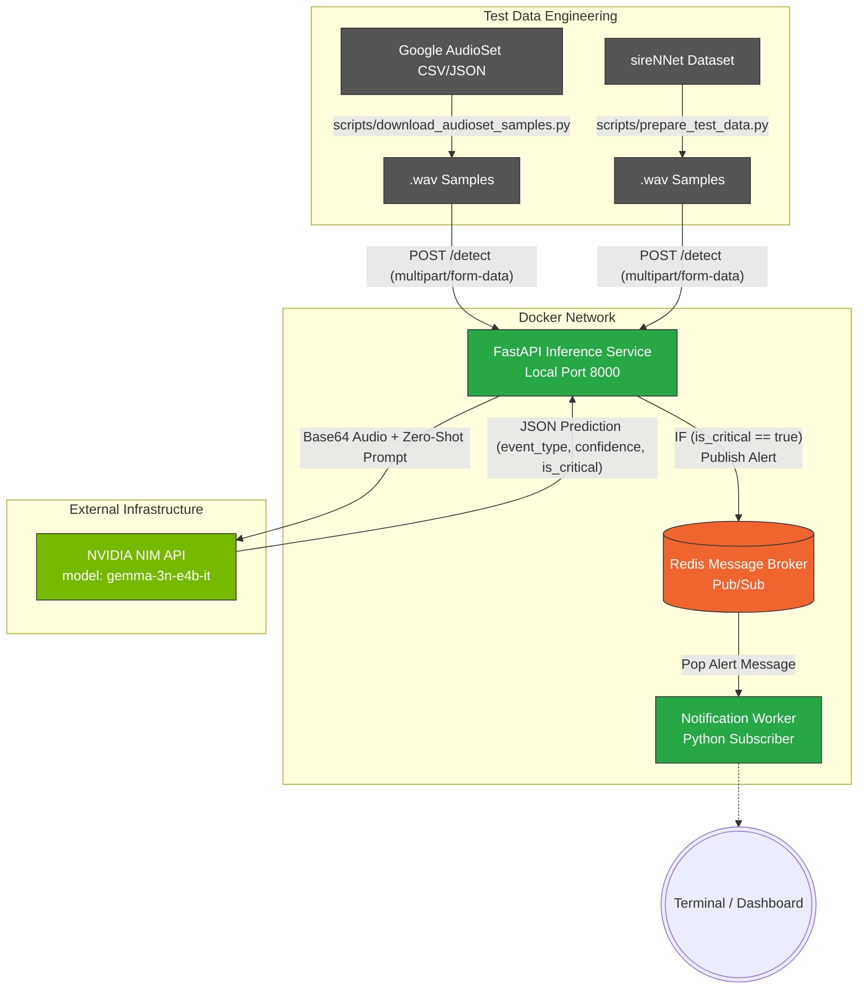

# NIM-Driven Audio Event Detection System

An End-to-End, Microservices-based Audio Event Detection pipeline using **NVIDIA NIM API (Gemma-3)** for zero-shot classification of critical audio events (Ambulances, Police Sirens, Firetrucks, Breaking Glass, etc.).

##  Architecture

The system abandons local model training in favor of a purely API-driven, cloud-native architecture. Audio streams are classified using a powerful multimodal LLM, and critical alerts are asynchronously dispatched via Redis Pub/Sub.



##  Features
- **Zero-Shot Classification:** Powered by NVIDIA NIM (`gemma-3n-e4b-it`) — no local training required.
- **Asynchronous Architecture:** Decoupled Inference and Notification layers using Redis.
- **Microservices Deployment:** Fully Dockerized using `docker-compose`.
- **Portable Data Engineering:** Automated extraction of test samples from **AudioSet** and **sireNNet** using `yt-dlp` and `pydub` (no system-wide `ffmpeg` required).
- **Automated Testing:** E2E testing pipelines against local `.wav` files with detailed JSON reporting.

---

## Requirements & Setup

1. **Docker & Docker Compose** must be installed.
2. An **NVIDIA NIM API Key** is required.

### 1. Configure the Environment
Copy the sample `.env` configuration file and add your key:
```bash
NVIDIA_API_KEY="nvapi-xxxx..."
```

### 2. Build & Deploy the Microservices
Start the entire stack instantly using Docker Compose:
```bash
docker-compose up --build
```
This spins up three containers:
- `redis`: The message broker.
- `inference-api`: The FastAPI server exposing port `8000`.
- `notification-worker`: The subscriber listening for alerts.

---

## Testing the Pipeline

We provide comprehensive scripts to generate test data and simulate real-time detection.

### Install local test dependencies
```bash
pip install requests pandas yt-dlp pydub static-ffmpeg
```

### 1. Extract Test Samples (Data Engineering)
Generate high-quality `.wav` samples for specific classes (Glass, Fire alarm, etc.) from Google AudioSet:
```bash
python scripts/download_audioset_samples.py
```
*This script uses `static-ffmpeg` to provide a portable FFmpeg backend automatically.*

### 2. Run the Automated E2E Pipeline
Send a random batch of test samples through the system:
```bash
python scripts/test_pipeline.py
```

### 3. Test a Specific Audio File
```bash
python scripts/test_pipeline.py \
    --file "data/test_samples/audioset/glass_Werch1AIKnE.wav" \
    --expected "glass"
```

---

## Project Structure

```text
audio/
├── docker-compose.yml
├── .env                  (API Keys)
├── README.md
├── scripts/
│   ├── download_audioset_samples.py (AudioSet engineering)
│   ├── prepare_test_data.py         (sireNNet engineering)
│   └── test_pipeline.py             (Automated E2E HTTP Testing)
└── services/
    ├── audio-inference-service/ (FastAPI + NVIDIA NIM)
    └── notification-service/    (Redis Subscriber)
```
