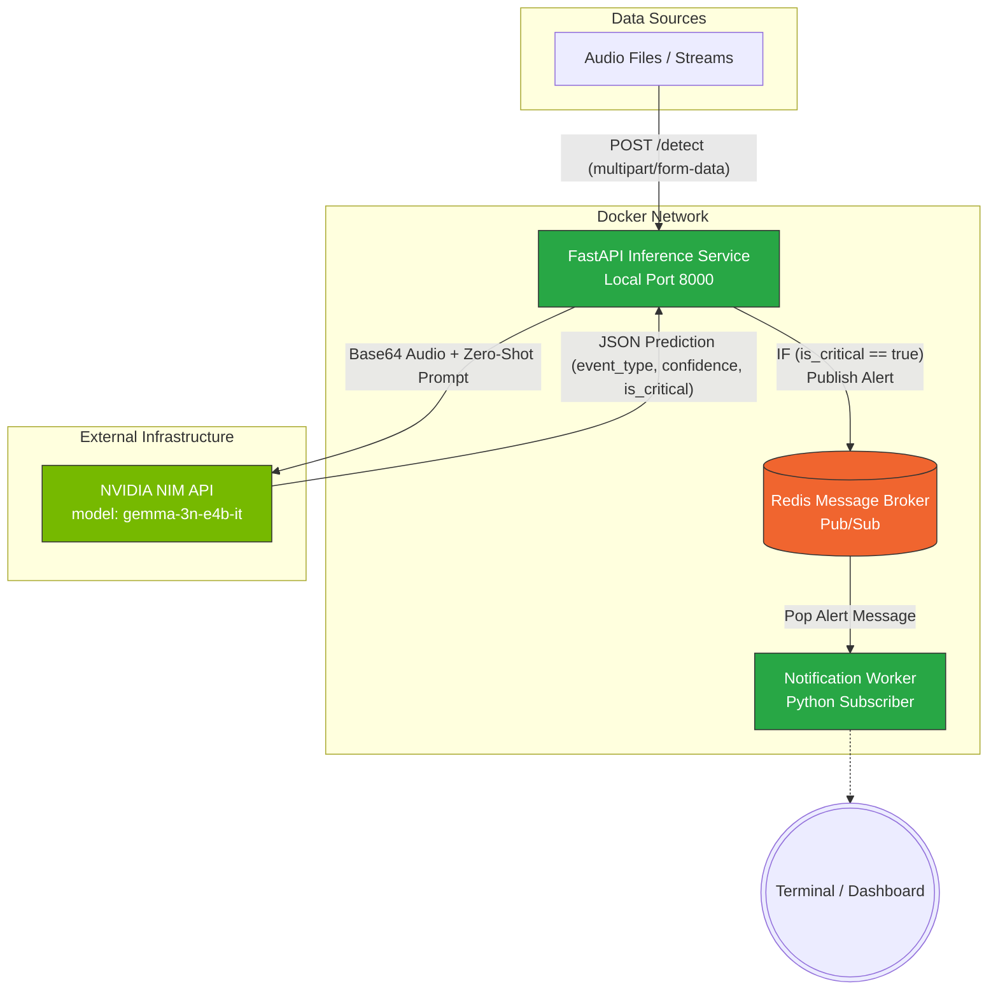

# 🚨 NIM-Driven Audio Event Detection System

An End-to-End, Microservices-based Audio Event Detection pipeline using **NVIDIA NIM API (Gemma-3)** for zero-shot classification of critical audio events (Ambulances, Police Sirens, Firetrucks, Breaking Glass, etc.).

## 🏗️ Architecture

The system abandons local model training in favor of a purely API-driven, cloud-native architecture. Audio streams are classified using a powerful multimodal LLM, and critical alerts are asynchronously dispatched via Redis Pub/Sub.



## 🚀 Features
- **Zero-Shot Classification:** Powered by NVIDIA NIM (`gemma-3n-e4b-it`) — no local training required.
- **Asynchronous Architecture:** Decoupled Inference and Notification layers using Redis.
- **Microservices Deployment:** Fully Dockerized using `docker-compose`.
- **Automated Testing:** E2E testing pipelines against local `.wav` files.

---

## 🛠️ Requirements & Setup

1. **Docker & Docker Compose** must be installed.
2. An **NVIDIA NIM API Key** is required.

### 1. Configure the Environment
Copy the sample `.env` configuration file:
```bash
# Edit .env and paste your NVIDIA_API_KEY
NVIDIA_API_KEY="nvapi-xxxx..."
```

### 2. Build & Deploy the Microservices
Start the entire stack instantly using Docker Compose:
```bash
docker-compose up --build
```
This spins up three containers on a shared bridge network:
- `redis`: The message broker.
- `inference-api`: The FastAPI server exposing port `8000` locally.
- `notification-worker`: The subscriber listening for alerts.

---

## 🧪 Testing the Pipeline

We provide an automated script to test the local system against a sample dataset (e.g., sireNNet).

### Install dependencies locally
Ensure your python virtual environment is active, then install the test runners:
```bash
pip install requests pandas yt-dlp
```

### Run the Automated E2E Pipeline
Send a random batch of test samples through the system, outputting a beautiful console summary and a structured JSON report:
```bash
python scripts/test_pipeline.py
```

### Test a Specific Audio File
Want to test exactly one file and skip the random batching? 
```bash
python scripts/test_pipeline.py \
    --file "data/sireNNet/firetruck/sound_202_1.wav" \
    --expected "firetruck"
```
*Note: Make sure your `NVIDIA_API_KEY` in `.env` is valid, or the API will return a 401 Unauthorized error!*

---

## 📂 Project Structure

```text
audio/
├── docker-compose.yml
├── .env                  (API Keys)
├── README.md
├── scripts/
│   ├── prepare_test_data.py   (yt-dlp dataset engineering)
│   └── test_pipeline.py       (Automated E2E HTTP Testing)
└── services/
    ├── audio-inference-service/
    │   ├── Dockerfile
    │   ├── requirements.txt
    │   └── main.py       (FastAPI + NVIDIA NIM integration)
    └── notification-service/
        ├── Dockerfile
        ├── requirements.txt
        └── main.py       (Redis Subscriber)
```
